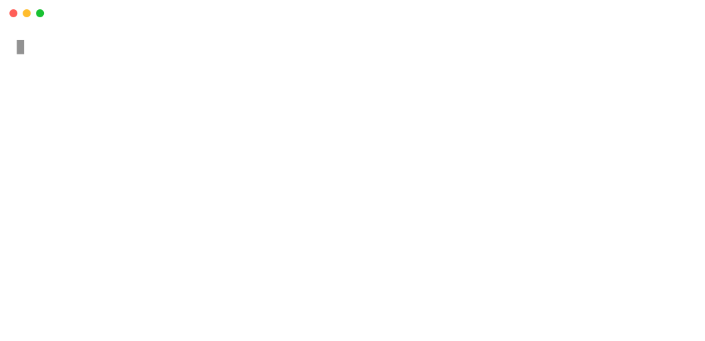

# kube-gpu-top

**The missing `kubectl top` for GPUs.**

<p align="center">
  
</p>

One command. Every GPU across every node. Pod-level attribution. No dashboards required.

## Why?

Checking GPU utilization in Kubernetes today is harder than it should be:

- **`kubectl top`** only shows CPU and memory. GPUs don't exist.
- **`nvidia-smi`** shows GPU metrics but has no concept of pods, namespaces, or workloads.
- **`nvtop` / `nvitop`** are great single-node tools but don't work across a cluster.
- **DCGM + Prometheus + Grafana** gives you everything, but requires deploying and maintaining a full observability stack just to answer "which pod is using my GPU?"

`kube-gpu-top` fills this gap. It's a single binary CLI backed by a lightweight DaemonSet agent. No Prometheus. No Grafana. Just a terminal command.

## Architecture

```
┌──────────────────────────────────────────────────────────────┐
│  User Machine                                                │
│                                                              │
│  kubectl gpu top ──── K8s API ── discover agent pods         │
│         │                                                    │
└─────────┼────────────────────────────────────────────────────┘
          │ gRPC :9401
          ▼
┌──────────────────────────────────────────────────────────────┐
│  GPU Node (DaemonSet: kube-gpu-agent)                        │
│                                                              │
│  ┌─────────────────┐       ┌──────────────────────────────┐  │
│  │   go-nvml       │       │  kubelet Pod Resources API   │  │
│  │                 │       │  /var/lib/kubelet/           │  │
│  │  GPU UUID       │       │  pod-resources/kubelet.sock  │  │
│  │  Utilization    │       │                              │  │
│  │  Memory         │       │  GPU UUID ──► Pod/Namespace  │  │
│  │  Temperature    │       │                              │  │
│  │  Power          │       └──────────────┬───────────────┘  │
│  └────────┬────────┘                      │                  │
│           │            JOIN on GPU UUID   │                  │
│           └────────────────┬──────────────┘                  │
│                            ▼                                 │
│                   GPUStatusResponse                          │
│            (metrics + pod attribution)                       │
└──────────────────────────────────────────────────────────────┘
```

The agent runs on each GPU node and does two things:
1. Queries **NVML** (via [go-nvml](https://github.com/NVIDIA/go-nvml)) for real-time GPU metrics
2. Queries the **kubelet Pod Resources API** to map each GPU UUID to its owning pod

It joins the two by GPU UUID and serves the result over gRPC. The CLI discovers agents via the Kubernetes API, fans out gRPC calls, and renders the table.

## Quick Start

**1. Deploy the agent DaemonSet:**

```bash
kubectl apply -f https://raw.githubusercontent.com/jia-gao/kube-gpu-top/main/deploy/daemonset.yaml
```

The agent runs only on nodes with `nvidia.com/gpu.present=true` and requests minimal resources (10m CPU, 32Mi memory).

**2. Install the CLI:**

```bash
go install github.com/jia-gao/kube-gpu-top/cmd/kubectl-gpu-top@latest
```

**3. Run it:**

```bash
kubectl gpu top
```

Filter by namespace:

```bash
kubectl gpu top --namespace ml-team
```

## Building from Source

```bash
git clone https://github.com/jia-gao/kube-gpu-top.git
cd kube-gpu-top

# Build both CLI and agent
make build

# Build only the CLI
make build-cli

# Build the agent container image
make docker-build

# Run protobuf codegen (requires protoc)
make proto

# Run tests
make test
```

Binaries are output to `bin/`.

## Requirements

- Kubernetes 1.20+
- NVIDIA GPUs with drivers installed on worker nodes
- [NVIDIA device plugin](https://github.com/NVIDIA/k8s-device-plugin) deployed (standard in most GPU clusters)

## Roadmap

- [x] Core agent with go-nvml + Pod Resources API
- [x] CLI table output with namespace filtering
- [ ] Time-slicing GPU support (PID-to-cgroup mapping)
- [ ] Interactive TUI mode (bubbletea)
- [ ] Waste detection (`kubectl gpu waste`)
- [ ] Helm chart
- [ ] Krew plugin distribution

## License

Apache 2.0
